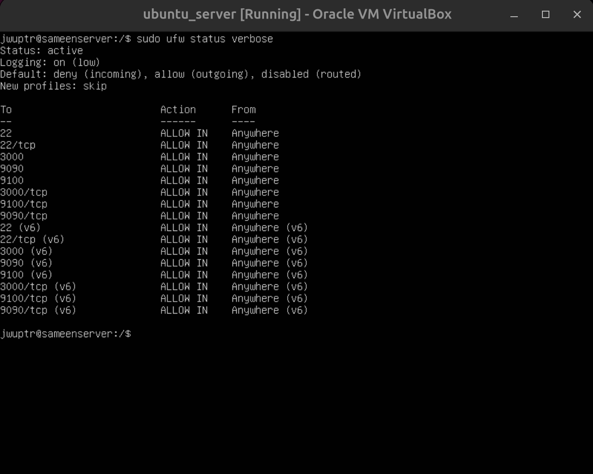
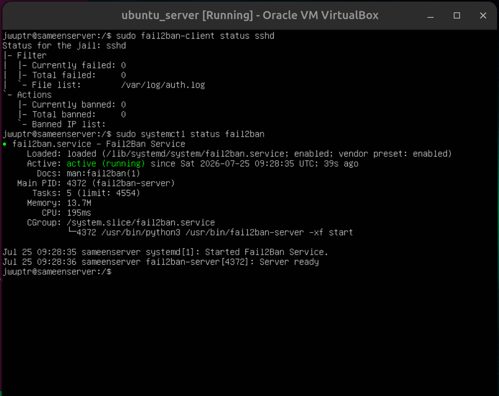
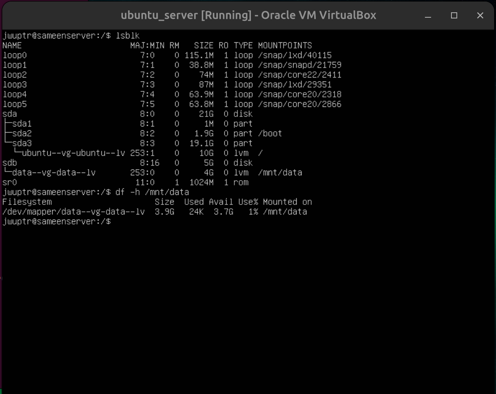
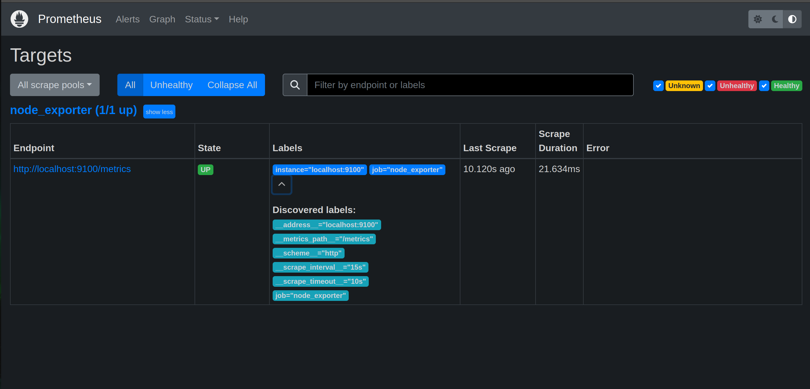
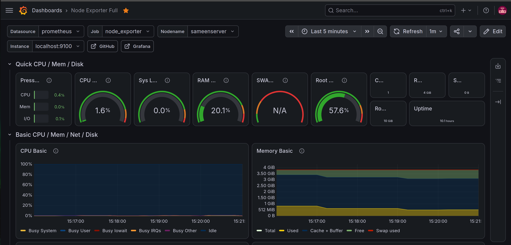
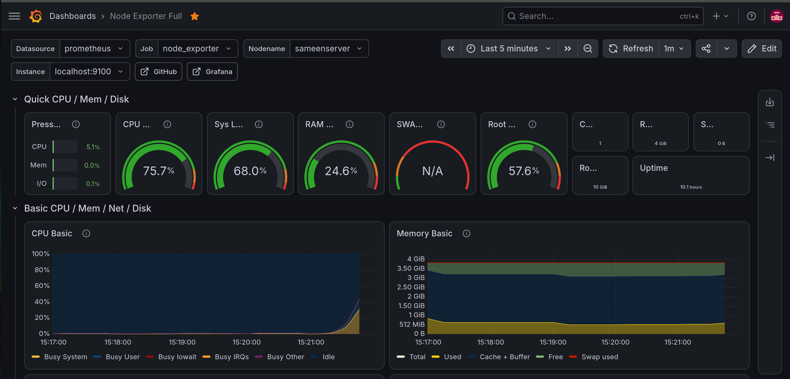
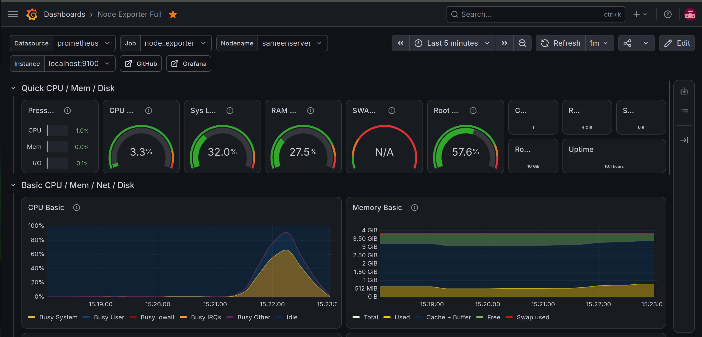

# Hardened Linux Server + Monitoring Dashboard

A self-built Ubuntu Server environment configured with a hardened Linux environment equipped with dynamic Logical Volume Management (LVM), active firewall enforcement, automated intrusion protection and a full monitoring panel using Prometheus, Node Exporter, and Grafana.

## Overview
This setup transforms a base Linux virtual machine (running in a VirtualBox VM) into a secure, scalable, and fully monitored server environment.

1. **SSH Hardening** — SSH key-based authentication with password access and root login explicitly disabled.
2. **Firewall (UFW)** — Strict ingress filter rules via Uncomplicated Firewall (UFW).
3. **fail2ban** — Fail2ban tracking failed authentication attempts and dynamically blocking offending IP addresses
4. **LVM Storage** — Dynamic physical and logical volume management using LVM, mounted persistently.
5. **Monitoring Stack** — Infrastructure metrics collection with Node Exporter, time-series metric collection with Prometheus, and interactive visualization dashboards via Grafana.

Each module is documented separately including the commands used.

## Architecture

```
Host Machine (Ubuntu, dual-boot)
   └── VirtualBox (Hypervisor)
        └── VM: ubuntu_server (Ubuntu Server 22.04 LTS)
             ├── Security layer:  SSH hardening → UFW → fail2ban
             ├── Storage layer:   LVM-managed second disk (/mnt/data)
             └── Monitoring layer: node_exporter → Prometheus → Grafana
```

## Features

### SSH Hardening
Password authentication is disabled entirely and root login is blocked, leaving key-based authentication as the only way in. Generated an ed25519 SSH key pair on the host machine and transferred the public key. This removes brute-force password guessing as a viable attack vector and forces privileged actions through `sudo`, creating an audit trail of who ran what.
📄 [ssh/sshd_config_changes.md](ssh/sshd_config_changes.md)


### Firewall (UFW)
Implemented default security policies: block incoming connections and permit outgoing traffic. Only SSH (22) and the monitoring stack's ports (3000 for grafana, 9090 for Prometheus and 9100 for node_exporter) are opened, keeping the server's attack surface as small as possible.
📄 [firewall/ufw_rules.md](firewall/ufw_rules.md)
<!-- 


**'sudo ufw status verbose' confirming active rule policies.** -->

### fail2ban
Continuously watches SSH auth logs and automatically bans any IP that racks up repeated failed login attempts within a set time window. This adds an automated layer of intrusion prevention on top of the firewall.
📄 [fail2ban/jail.local](fail2ban/jail.local)
<!-- 


**Active status of the fail2ban system daemon** -->

### 💾 LVM-Managed Storage
A second virtual disk is managed through LVM rather than a raw partition, then formatted and mounted persistently. This makes the storage resizable later without downtime.
📄 [storage/lvm_setup.md](storage/lvm_setup.md)

<!-- 

**Output of the commands showing the 4G logical volume mounted persistently** -->

<table border="0">
  <tr>
    <td align="center" width="30%">
      <br/>
      <sub><b>(a)</b>'sudo ufw status verbose' confirming active rule policies.</sub>
    </td>
    <td align="center" width="30%">
      <br/>
      <sub><b>(b)</b>Active status of the fail2ban system daemon</sub>
    </td>
    <td align="center" width="30%">
      <br/>
      <sub><b>(c)</b> Output of the commands showing the 4G logical volume mounted persistently</sub>
    </td>
  </tr>
</table>
<p align="center">
  <sub><b>Figure 1:</b> ufw, fail2ban and LVM status</sub>
</p>

### 📊 Monitoring Stack
A full pull-based observability pipeline: **node_exporter** exposes system metrics, **Prometheus** scrapes and stores them on a schedule, and **Grafana** visualizes everything in a live dashboard covering CPU, memory, disk, and network usage.
📄 [monitoring/](monitoring/)

<!--  -->


## CPU Load Testing
Executed background CPU load generation (yes > /dev/null &) to verify real-time metric spikes across Prometheus targets and Grafana dashboards. Later the process was terminated to confirm the system returned to idle metrics, validating end-to-end monitoring responsiveness.

<!-- 

**Grafana dashboard recording nominal idle CPU load**



**Real-time telemetry capturing a immediate CPU utilization spike**



**Complete CPU load bell curve recorded in Grafana following process termination, validating end-to-end monitoring responsiveness.** -->

<table border="0">
  <tr>
    <td align="center" width="30%">
      <br/>
      <sub><b>(a)</b> CPU status before load</sub>
    </td>
    <td align="center" width="30%">
      <br/>
      <sub><b>(b)</b> CPU status during load</sub>
    </td>
    <td align="center" width="30%">
      <br/>
      <sub><b>(c)</b> CPU status after load</sub>
    </td>
  </tr>
</table>
<p align="center">
  <sub><b>Figure 1:</b> Grafana dashboard showing load metrics in three different states</sub>
</p>

## Reproducing This Setup

1. Create an Ubuntu Server 22.04 LTS VM (VirtualBox or similar hypervisor)
2. Follow each module's documentation in order (SSH → Firewall → fail2ban → Storage → Monitoring)

## Stack

Ubuntu Server 22.04 LTS · OpenSSH · UFW · fail2ban · LVM · Prometheus · node_exporter · Grafana